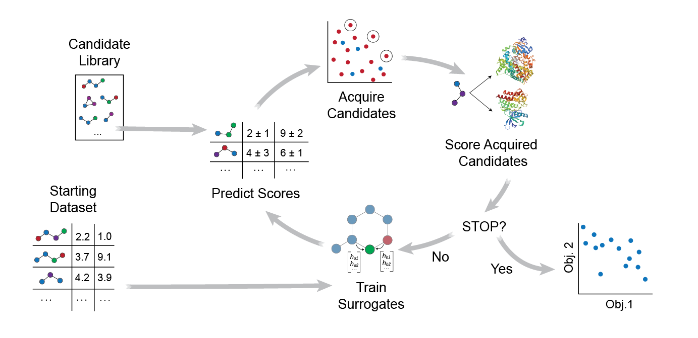

# MolPAL: Multi-Objective Molecular Pool-based Active Learning
# Efficient Exploration of Virtual Chemical   Libraries through Active Learning

## Overview
This repository contains the source of the multi-objective extension of MolPAL for the accelerated discovery of compounds in high-throughput virtual screening environments. This version of MolPAL is described in the preprint (*insert preprint link*). For a description of MolPAL's object model, requirements, and other details, please refer to [the main MolPAL branch](https://github.com/coleygroup/molpal#molpal-molecular-pool-based-active-learning). 

## Table of Contents
- [Overview](#overview)
- [Table of Contents](#table-of-contents)
- [Installation](#installation)
- [Running MolPAL](#running-molpal)
  * [Setting up a ray cluster](#setting-up-a-ray-cluster)
  * [Configuration files](#configuration-files)
  * [Required Settings](#required-settings)
  * [Optional Settings](#optional-settings)
- [Reproducing Experimental Results](#reproducing-experimental-results)
- [Future Goals](#future-goals)

## Installation
The first step in installing MolPAL is to clone this repository: `git clone <this_repo>`

The easiest way to install all dependencies is to use conda along with the supplied [environment.yml](environment.yml) file, but you may also install them manually, if desired. All libraries listed in that file are __required__ before using `MolPAL`

The following packages are _optional_ to install before running MolPAL:
- cudatoolkit: whichever version matches your CUDA build if utilizing GPU acceleration for PyTorch-based models (MPN)
- [map4](https://github.com/reymond-group/map4) and [tmap](https://github.com/reymond-group/tmap): if utilizing the map4 fingerprint
- [optuna](https://optuna.readthedocs.io/en/stable/installation.html): if planning to perform hyperparameter optimization
- matplotlib: to generate plots from the publication
- seaborn: to generate plots from the publication

#### setup via mamba
__NOTE__: the `environment.yml` must be edited to reflect your machine's setup. To do this, uncomment out the appropriate line depending on your CUDA version or if you lack a GPU entirely. If you need a lower CUDA version than those specified in the environment YAML file, comment out the PyTorch line as well and go to the [pytorch wesbite](https://pytorch.org/get-started/locally/) to set the channels and versions of both the pytorch and cudatoolkit packages properly.

0. (if necessary) [install mamba](https://mamba.readthedocs.io/en/latest/installation.html)
1. `cd /path/to/molpal`
2. `mamba env create -f environment.yml`
3. `mamba activate molpalx`
4. `pip install -r requirements.txt`
5. `python setup.py develop`

Before running MolPAL, be sure to first activate the environment: `mamba activate molpalx`

## Running MolPAL

### Setting up a ray cluster
MolPAL parallelizes objective function calculation and model inference (training coming later) using the [`ray`](ray.io) library. MolPAL will automatically start a ray cluster if none exists, but this is highly limiting because it can't leverage distributed resources nor will it accurately reflect allocated resources (i.e, it will think you have access to all N cores on a cluster node, regardless of your allocation.) 

_Ex._: To specify a local ray cluster with all the resources on your machine, type:
`ray start --head`

_Ex._: To restrict the ray cluster to using only N CPUs and M GPUs, type:
`ray start --head --num-cpus N --num-gpus M`

To properly leverage multi-node allocations, you must set up a ray cluster manually before running MolPAL. The [documentation](https://docs.ray.io/en/master/cluster/index.html) has several examples of how to set up a ray cluster, and the only thing specific to MolPAL is the reliance on two environment variables: `redis_password` and `ip_head`. MolPAL will use the values of these environment variables to connect to the proper ray cluster. An example of this may be seen in the SLURM submission script [`run_molpal.batch`](run_molpal.batch)

MolPAL will automatically use a GPU if it detects one in the ray cluster. If this is undesired, you can specify `--num-gpus 0` when starting ray and running `export CUDA_VISIBLE_DEVICES=''` before starting MolPAL

### Configuration files
The general command to run multi-objective MolPAL is as follows:

`python run.py -o {LOOKUP,DOCKING} --objective-config <path/to/objective_config_1> <path/to/objective_config_2> --libary <path/to/library.csv[.gz]> [additional library arguments] [additional model/encoding/acquistion/stopping/logging arguments]`

Alternatively, you may use a configuration file to run MolPAL, like so:

`python run.py --config <path/to/config_file>`

Sample configuration files, used to generate the data in the publication, can be found [here](moo_runs/config/).

Configuration files accept the following syntaxes:
- `--arg value` (argparse)
- `arg: value` (YAML)
- `arg = value` (INI)
- `arg value`

### Required Settings
The primary purpose of MolPAL is to accelerate virtual screens in a prospective manner. MolPAL supports computational docking screens using the [`pyscreener`](https://github.com/coleygroup/pyscreener) library. 

- `-o` or `--objective`: A list of objective types. Choices include `docking` for docking objectives (uses `pyscreener`), `lookup` for lookup objectives, and `dockinglookup` for a lookup objective that caps values at 0. Each objective must have a corresponding config file.
- `--objective-config`: filepaths of config files for each objective. Each config file contains information about the objective. 
  For `lookup` or `dockinglookup` objectives, settings include: 
  * `--path`: the filepath of a CSV file containing score information for each input
  * `--smiles-col`: the column that contains SMILES strings 
  * `--score-col`: the column that contains the objective values 
  * `--minimize`: flag to minimize objective values (by default `False`)
  * `--sep`: the library file's delimiter (by default `,`)
  
  For `docking` objectives, settings include: 
  * `--minimize`: whether to minimize the docking score values (by default `True`)
  * `--receptors`: path to a receptor pdb file
  * `--screen-type`: the type of docking screen to perform (e.g., `vina`, `qvina`)
  * `--size`: the x-, y-, and z-radii of the docking box
  * `--center`:  the x-, y-, and z-coordinates of the center of the docking box
  * Please refer to the [`pyscreener`](https://github.com/coleygroup/pyscreener/tree/main) documentation for more docking arguments. 

- `--library` or `--libraries`: the filepaths of CSV files containing the virtual library as SMILES (or CXSMILES) strings. If CXSMILES, pass the additional `--cxsmiles` flag

### Optional Settings
- `--metric`: the acquisition function to use. Multi-objective options include `pi` (applies probability of hypervolume improvement), `ei` (applies expected hypervolume improvement), and `nds`. If scalarization is used, single-objective acquisition functions including `greedy`, `ucb`, `pi`, and `ei` can be used. 
- `--scalarize`: a flag to scalarize the objectives. If included, objectives are scalarized using equal weights. By default, `pi` and `ei`apply hypervolume metrics. If `--scalarize` is included, single-objective expected improvement and probability of improvement are used. 
- `--fps`: the filepath of an hdf5 file containing the precomputed fingerprints of your virtual library. MolPAL relies on the assumption that the ordering of the fingerprints in this file is exactly the same as that of the library file and that the encoder used to generate these fingerprints is exactly the same as the one used for model training. MolPAL handles writing this file for you if unspecified, so this option is mostly useful for avoiding the overhead at startup of running MolPAL again with the same library/featurizer settings.
- `--invalid-idxs`: unless MolPAl prepares your fingerprints file for you, it must validate each SMILES string in the library and determine the set of invalid indices in the virtual library. This can be time-consuming for large virtual libraries, so passing this set to MolPAL, if known, can save time. 
- `--max-iters`: the maximum number of iterations of exploration. (Default = 50)
- `--budget`: Alternatively, if you would like to limit MolPAL to exploring a fixed fraction of the libary or number of inputs, you can specify that by setting this value. (Default = 1.0)
- `--model`: the type of models to use. Collects entries as a list, which must equal the number of objectives optimized. If `--scalarize` is used, the first model listed will be applied. 
  * `--conf-method`: the confidence estimation method to use for the NN or MPN models. Choices include `ensemble`, `dropout`, `mve`, and `none`. (Default = 'none'). NOTE: the MPN model does not support ensembling. Currently the same confidence estimation method must be applied to all models, so only one entry is accepted. 
  * `--retrain-from-scratch`: a flag to retrain models from scratch at each iteration or retrained online. If not included, they will be retrained online. 
- `--seed`: the random seed to use for initialization
- `--model-seed`: the random seed to use for model initialization Not specifying will result in random model initializations each time the model is trained

## Reproducing Experimental Results

All data in the preprint were generated using files in the [scripts](scripts/) folder using configuration files in the [moo_runs](moo_runs/) folder. Molecular fingerprints for the libraries were produced first with the [fingerprints script](scripts/fingerprints.py). The DOCKSTRING library with docking scores is available [here](https://figshare.com/articles/dataset/dockstring_dataset/16511577?file=35948138). Docking scores to Enamine's screening library to CYP3A4, EGFR, and IGF1R are available here [here](https://figshare.com/articles/dataset/Enamine_screen_CYP3A4_EGFR_IGF1R_zip/23978547). Data analysis was performed using files in the [figure_scripts](figure_scripts/) folder. 

## Future Goals

While the multi-objective extension of MolPAL in this branch is usable, we have outlined some next steps and future goals here: 

1. Integration into the main branch of MolPAL 
2. Incorporate random scalarization and Chebyshev scalarization as acquisition strategies 
3. Explore alternative diversity-enhanced acquisition strategies 
